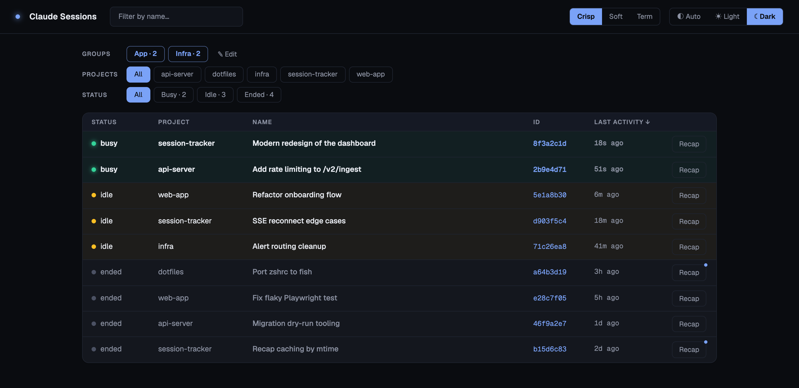
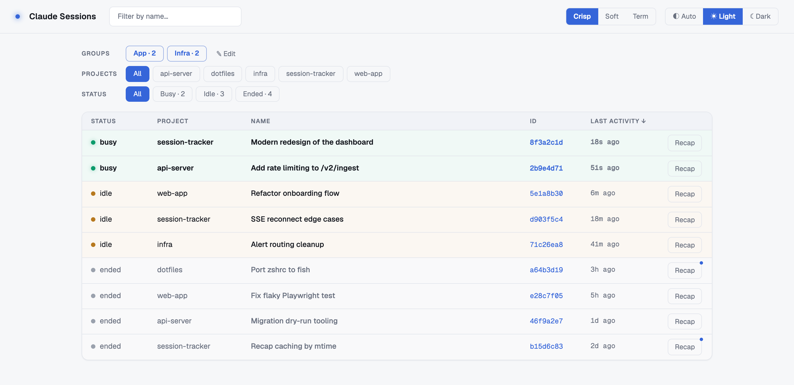
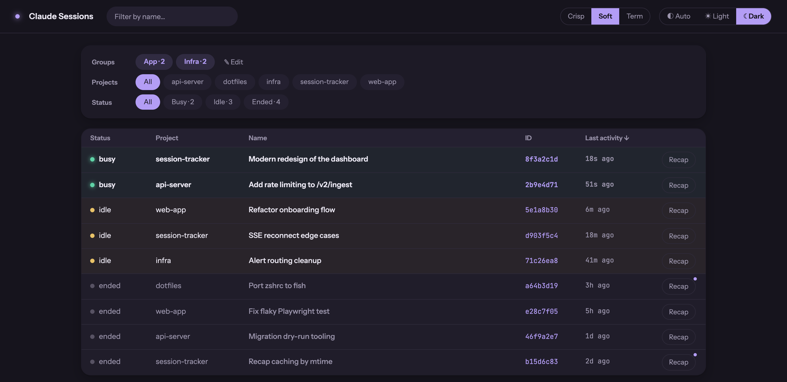
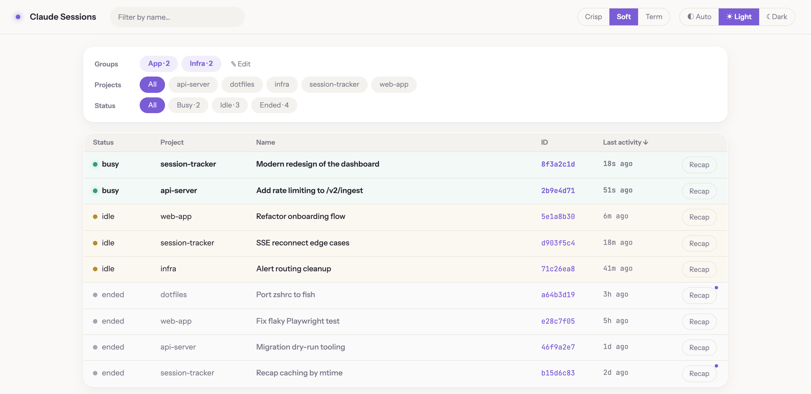
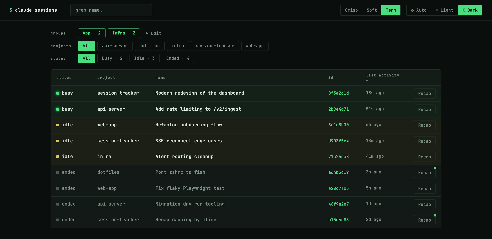
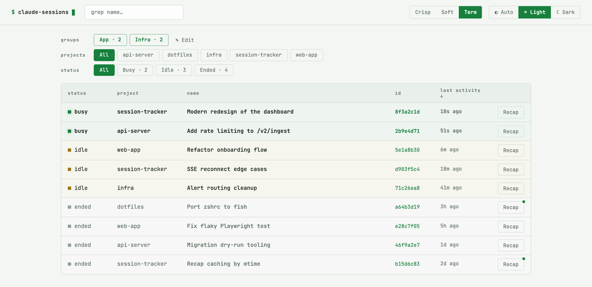

# Claude Session Tracker

A local web dashboard that tracks every Claude Code session on this machine —
historical and live — in real time. Zero runtime dependencies: plain Node.js,
no `npm install`, no build step.



## Features

- **All sessions in one table** — indexed from `~/.claude/projects`, with
  name, project, session ID (click to copy), and relative last-activity time;
  sortable by status, project, name, or last activity.
- **Live status** — busy / idle / ended, derived from `~/.claude/sessions`
  registry files with PID liveness checks. Rows are tinted and busy rows
  bolded so live work stands out.
- **Real-time updates** — `fs.watch` + debounce pushes changes to the browser
  over Server-Sent Events; no manual refresh.
- **Filtering** — free-text name filter, multi-select project pills,
  user-defined project *groups* (edited in the dashboard, persisted
  server-side), and multi-select status pills (busy / idle / ended, with live
  counts).
- **Detail modal** — click a row for the full project path, session ID, and a
  copyable `claude --resume <id>` command.
- **On-demand recaps** — a Recap button summarizes any session's conversation
  via headless `claude -p --model haiku` on your subscription (no API key).
  Recaps are cached by file mtime; ↻ regenerates; a dot marks sessions whose
  recap is already cached.
- **Three skins, themed** — Crisp / Soft / Terminal looks with an
  auto (system) / light / dark theme switch, both persisted in the browser.

### Skins

|  | Dark | Light |
|---|---|---|
| **Crisp** |  |  |
| **Soft** |  |  |
| **Terminal** |  |  |

## Quick start

Requires Node.js 20+ and the `claude` CLI on your PATH (for recaps).

```sh
bin/cst start     # starts the server (detached) and opens the dashboard
```

The dashboard is at <http://localhost:4747>. Other commands:

```sh
bin/cst status    # running / stopped
bin/cst stop      # graceful shutdown
```

Symlink `bin/cst` somewhere on your PATH to run it as `cst` from anywhere.
To run in the foreground instead: `node server.js`.

## Configuration

All optional, via environment variables:

| Variable | Default | Purpose |
|---|---|---|
| `TRACKER_PORT` | `4747` | HTTP port |
| `TRACKER_CLAUDE_DIR` | `~/.claude` | Claude Code data directory |
| `TRACKER_RECAP_CMD` | `claude` | Command used for recaps |
| `TRACKER_RECAP_MODEL` | `haiku` | Model passed to `claude -p --model` |
| `TRACKER_GROUPS_FILE` | `groups.json` (repo root) | Where pill groups are persisted |

## Layout

```
server.js           HTTP server + SSE + watch/refresh loop
lib/                indexer, live registry, recap, groups modules
public/index.html   the whole UI (vanilla JS + CSS, one file)
bin/cst             start/stop/status launcher
test/               node:test unit + integration tests
groups.json         your pill groups (user data, gitignored)
.cache/             index cache, recaps, server log/pid (disposable, gitignored)
```

Original design specs (point-in-time, pre-redesign) are in
`docs/superpowers/specs/`.

## Testing

```sh
node --test
```

Unit tests per module run against fixture `.jsonl` files; recap logic is
tested against a fake `claude` stub; integration tests spawn the real server
on a test port and exercise every route, including the
watch → debounce → SSE broadcast pipeline.

## Security notes

The server binds `127.0.0.1` only and is meant for single-user local use.
Requests with a foreign `Host` header are rejected (DNS-rebinding guard), as
are non-GET requests carrying a foreign `Origin` (cross-site write guard).
There is no authentication beyond that: any local process can hit the API —
same trust level as being able to `kill` your processes. Don't expose the
port beyond localhost.
